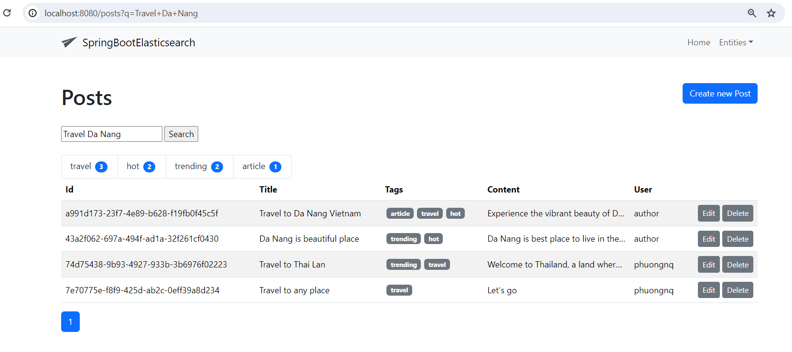

# SpringBoot Elasticsearch


## Development

When starting the application `docker compose up` is called and the app will connect to the contained services.
[Docker](https://www.docker.com/get-started/) must be available on the current system.

During development it is recommended to use the profile `local`. In IntelliJ `-Dspring.profiles.active=local` can be
added in the VM options of the Run Configuration after enabling this property in "Modify options". Create your own
`application-local.yml` file to override settings for development.

Lombok must be supported by your IDE. For IntelliJ install the Lombok plugin and enable annotation processing -
[learn more](https://bootify.io/next-steps/spring-boot-with-lombok.html).

After starting the application it is accessible under `localhost:8080`.

## Build

The application can be built using the following command:

```
gradlew clean build
```

Start your application with the following command - here with the profile `production`:

```
java -Dspring.profiles.active=production -jar ./build/libs/spring-boot-elasticsearch-0.0.1-SNAPSHOT.jar
```

If required, a Docker image can be created with the Spring Boot plugin. Add `SPRING_PROFILES_ACTIVE=production` as
environment variable when running the container.

```
gradlew bootBuildImage --imageName=org.phuongnq/spring-boot-elasticsearch
```

## Elasticsearch config
### Get fingerprint in elastic container

```shell
openssl s_client -connect localhost:9200 -servername localhost -showcerts </dev/null 2>/dev/null \
| openssl x509 -fingerprint -sha256 -noout -in /dev/stdin
```

Setting env variables: ES_SSL: ${fingerprint_value}

Kibana dashboard

| Host url              | username | password |
| --------------------- | -------- | -------- |
| http://localhost:5601 | elastic  | changeme |

## Explanation

Spring boot create ClientConfiguration bean

```java
@Configuration
@RequiredArgsConstructor
public class ElasticSearchConfiguration extends ElasticsearchConfiguration {
    private final ElasticsearchProperties elasticsearchProperties;
    private final ProjectProperties projectProperties;
    @Override
    public ClientConfiguration clientConfiguration() {
        return ClientConfiguration.builder()
                .connectedTo(elasticsearchProperties.getUris().toArray(String[]::new))
                .usingSsl(projectProperties.getElasticsearch().getSslFingerprintCa()) //add the generated sha-256 fingerprint
                .withBasicAuth(elasticsearchProperties.getUsername(), elasticsearchProperties.getPassword()) //add your username and password
                .build();
    }
}
```

Reindexing on initialize application
```java
@Component
@RequiredArgsConstructor
public class IndexerRunner implements ApplicationRunner {
    private final ElasticsearchOperations elasticsearchOperations;
    private final PostRepository repository;

    @Override
    @Transactional
    public void run(ApplicationArguments args) throws Exception {
        if (elasticsearchOperations.indexOps(PostDocument.class).exists()) {
            elasticsearchOperations.indexOps(PostDocument.class).delete();
            elasticsearchOperations.indexOps(PostDocument.class).create();
            elasticsearchOperations.indexOps(PostDocument.class).putMapping();
        }

        List<IndexQuery> indexQueries = repository.findAll()
                .stream()
                .map(this::indexRequest)
                .collect(Collectors.toList());

        List<IndexedObjectInformation> informationList =
                elasticsearchOperations.bulkIndex(indexQueries, PostDocument.class);

        log.info("### Finished reindexing {} documents. ###", informationList.size());
    }
    ...
}
```


Elasticsearch query:
```json
POST /post/_search?pretty
  {
    "query": {
      "multi_match": {
        "query": "Travel Da Nang", # Content of full text query
        "fields": ["title^2", "content"] # Boosting title with double score
      }
    },
    "from": 0, # Pagination
    "size": 20, # Pagination
    "aggs": {
      "type_aggregation": {
        "terms": {
          "field": "tags" # Apply to aggregate by this field
        }
      }
    }
  }
```
Example response: 
```json
{
  ...
  "hits": {
    "total": {
      "value": 4,
      "relation": "eq"
    },
    "max_score": 4.9546833,
    "hits": [
      {
        "_index": "post",
        "_id": "a991d173-23f7-4e89-b628-f19fb0f45c5f",
        "_score": 4.9546833,
        "_source": {
          "_class": "org.phuongnq.elasticsearch.document.PostDocument",
          "title": "Travel to Da Nang Vietnam",
          "content": "Experience the vibrant beauty of Da Nang, Vietnam’s coastal paradise. From pristine beaches and stunning marble mountains to rich cultural heritage and delicious cuisine, Da Nang offers an unforgettable adventure. Join us for a journey where modern marvels meet ancient wonders, and let the charm of Da Nang captivate you. Book your tour today and explore the heart of Vietnam!",
          "user": "author",
          "tags": [ "article", "travel", "hot" ]
        }
      },
      {
        "_index": "post",
        "_id": "43a2f062-697a-494f-ad1a-32f261cf0430",
        "_score": 3.6556172,
        "_source": {
          "_class": "org.phuongnq.elasticsearch.document.PostDocument",
          "title": "Da Nang is beautiful place",
          "content": "Da Nang is best place to live in the world",
          "user": "author",
          "tags": [ "trending", "hot" ]
        }
      },
      {
        "_index": "post",
        "_id": "74d75438-9b93-4927-933b-3b6976f02223",
        "_score": 1.4549544,
        "_source": {
          "_class": "org.phuongnq.elasticsearch.document.PostDocument",
          "title": "Travel to Thai Lan",
          "content": "Welcome to Thailand, a land where ancient traditions harmoniously blend with modern vibrancy, offering an experience that is both exhilarating and enriching. Known as the Land of Smiles, Thailand is a treasure trove of cultural wonders, natural beauty, and culinary delights. Join us on a journey through this captivating country and discover why it remains one of the world's top travel destinations.",
          "user": "phuongnq",
          "tags": [ "trending", "travel" ]
        }
      },
      {
        "_index": "post",
        "_id": "7e70775e-f8f9-425d-ab2c-0eff39a8d234",
        "_score": 1.4549544,
        "_source": {
          "_class": "org.phuongnq.elasticsearch.document.PostDocument",
          "title": "Travel to any place",
          "content": "Let's go",
          "user": "phuongnq",
          "tags": [ "travel" ]
        }
      }
    ]
  },
  "aggregations": {
    "type_aggregation": {
      "doc_count_error_upper_bound": 0,
      "sum_other_doc_count": 0,
      "buckets": [
        {
          "key": "travel",
          "doc_count": 3
        },
        {
          "key": "hot",
          "doc_count": 2
        },
        {
          "key": "trending",
          "doc_count": 2
        },
        {
          "key": "article",
          "doc_count": 1
        }
      ]
    }
  }
}
```

